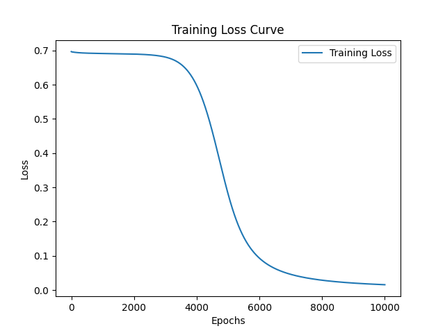
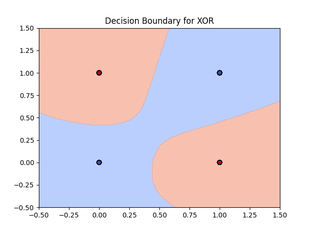

# XOR Neural Network from Scratch (NumPy)

This project implements a simple feed-forward neural network **from scratch using only NumPy** to solve the classic **XOR problem**.  

The network:
- Uses **1 hidden layer** with sigmoid activation.
- Trains using **binary cross-entropy loss**.
- Implements **forward propagation** and **backpropagation** manually.
- Achieves **near-zero training loss** and **100% accuracy** on clean test data.

--------------------------------------------------------------------------------------------

## Features
- **Custom sigmoid & derivative**
- **Weight initialization (He-style scaling)**
- **Forward propagation**
- **Backpropagation with gradient descent**
- **Cross-entropy loss with clipping for numerical stability**
- **Training & evaluation on noisy and clean XOR datasets**

--------------------------------------------------------------------------------------------

## Results

- **Training Loss**: Converges to nearly **0**
- **Test Accuracy**: **1.0** (perfect classification on clean XOR dataset)

Training log:
```
At iteration 0, loss = 0.6966563712087405
At iteration 1000, loss = 0.691192443012384
At iteration 2000, loss = 0.68947298213267
At iteration 3000, loss = 0.6806926878553498
At iteration 4000, loss = 0.5975943894718366
At iteration 5000, loss = 0.2809131252915069
At iteration 6000, loss = 0.09318225691895651
At iteration 7000, loss = 0.045978814728285085
At iteration 8000, loss = 0.028842593832507916
At iteration 9000, loss = 0.020514097382081466
At iteration 10000, loss = 0.015714567554442175
```

Final metrics:
- **Training Loss**: ~0.015
- **Test Accuracy**: 1.0

--------------------------------------------------------------------------------------------

## Visualizations

### Training Loss Curve
Training loss decreases smoothly to near zero:



--------------------------------------------------------------------------------------------

### Decision Boundary
The trained network learns the correct XOR classification regions:



--------------------------------------------------------------------------------------------

## Model Architecture
- **Input Layer**: 2 neurons (XOR inputs)
- **Hidden Layer**: 14 neurons, sigmoid activation
- **Output Layer**: 1 neuron, sigmoid activation

--------------------------------------------------------------------------------------------

## Dataset
Two datasets are generated:
1. **Training Set (with noise)** → Slightly perturbed XOR inputs  
2. **Test Set (clean)** → Perfect XOR mapping (no noise)

--------------------------------------------------------------------------------------------

## Usage

1. Clone the repo:
   ```bash
   git clone https://github.com/MohitAryal/xor-numpy-net.git
   cd xor-numpy-net
   ```

2. Run training:
   ```bash
   python main.py
   ```

3. Expected Output:
   ```
   At iteration 0, loss = 0.6966
   ...
   Final Test Accuracy: 1.0
   ```

--------------------------------------------------------------------------------------------

## 📦 Requirements
- Python 3.8+
- NumPy
- Matplotlib (for plotting)

Install dependencies:
```bash
pip install numpy matplotlib
```

--------------------------------------------------------------------------------------------

## Plotting the Loss Curve

Add after training:
```python
import matplotlib.pyplot as plt

plt.plot(losses, label="Training Loss")
plt.xlabel("Epochs")
plt.ylabel("Loss")
plt.title("Training Loss Curve")
plt.legend()
plt.savefig("loss_curve.png")
plt.show()
```

--------------------------------------------------------------------------------------------

## Visualizing Decision Boundary

After training, add:

```python
import matplotlib.pyplot as plt

# Generate grid
xx, yy = np.meshgrid(np.linspace(-0.5, 1.5, 200), np.linspace(-0.5, 1.5, 200))
grid = np.c_[xx.ravel(), yy.ravel()]

# Forward pass
_, Z = forward_propagation(learned_w1, learned_b1, learned_w2, learned_b2, grid)
Z = Z.reshape(xx.shape)

# Plot decision regions
plt.contourf(xx, yy, Z > 0.5, alpha=0.6, cmap=plt.cm.coolwarm)
plt.scatter(X_test[:, 0], X_test[:, 1], c=y_test, s=40, cmap=plt.cm.coolwarm, edgecolors="k")
plt.title("Decision Boundary for XOR")
plt.savefig("decision_boundary.png")
plt.show()
```

--------------------------------------------------------------------------------------------

## Key Takeaways
- The XOR problem is **not linearly separable**, requiring a hidden layer to solve.
- Even a simple 2-layer neural network trained with backpropagation can learn XOR perfectly.
- This project demonstrates **how neural networks work under the hood** without relying on deep learning frameworks.

--------------------------------------------------------------------------------------------